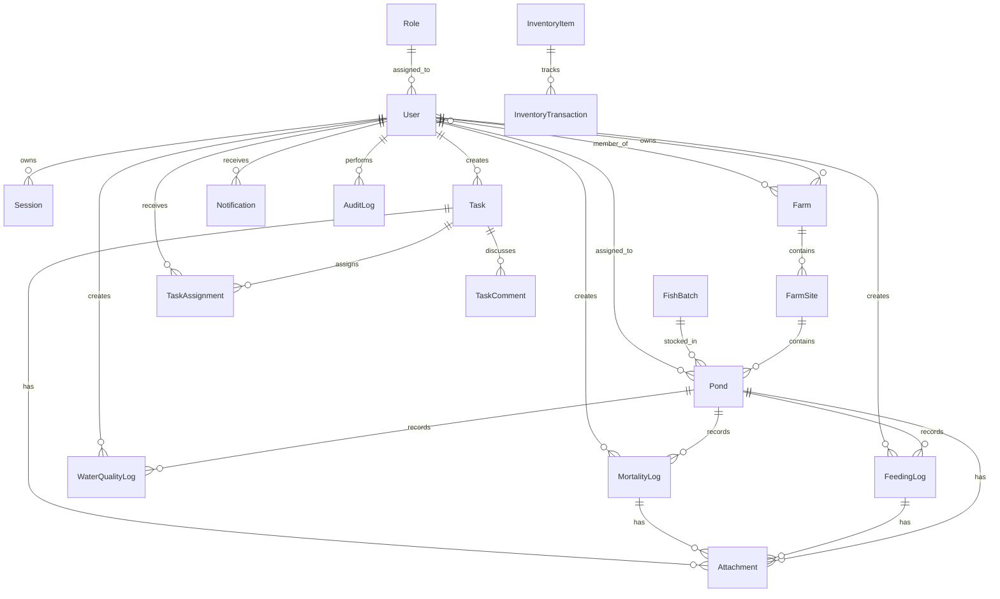

# AquaSphere Architecture Blueprint

## Product Standard

AquaSphere is a role-based aquaculture operations platform for multi-farm management, pond monitoring, field tasks, inventory, finance, and offline synchronization.

Primary slogan: Smart Aquaculture. Smarter Decisions.

## Layered Architecture

```text
React PWA
  -> REST API
  -> Business logic
  -> Prisma ORM
  -> PostgreSQL
  -> Backup and sync services
```

The frontend should remain role-aware, mobile-first, and optimized for repeated field workflows. The API should keep farm records structured and auditable.

## Core ERD



## Dashboard Roles

Owner dashboard: revenue, expenses, profit, farm health score, alerts across all farms, worker performance, monthly trends.

Worker dashboard: today's tasks, quick records, assigned ponds, pending sync, photo upload, problem reporting.

Finance dashboard: expenses, income, purchases, sales, budgets, profit and loss, export-ready reports.

Inventory dashboard: stock levels, low-stock alerts, usage trends, purchase orders, supplier activity, consumption by farm and pond.

Insights dashboard: summaries, risk warnings, suggested actions, disease guidance, feeding recommendations, water quality interpretation.

System management is handled by the Farm Owner in this version. Workers do not get management screens.

## Next Build Order

1. Add offline synchronization tables: device sync, sync queue, conflict records.
2. Add worker field forms for feeding, mortality, water level, and photo upload.
3. Add report exports for finance, pond performance, feed usage, and worker activity.
4. Add PWA service worker and local draft storage for workers.
5. Add owner-controlled user approval and worker account management.
